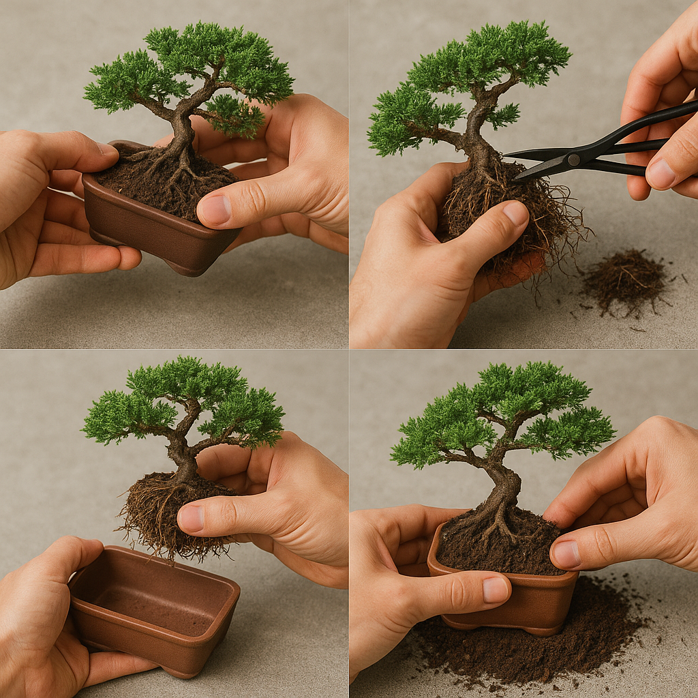

Repotting is an essential part of bonsai care. It provides the bonsai with fresh soil, allows for root pruning, and helps to maintain the bonsai's size and shape. Repotting frequency depends on the species and age of the bonsai, but generally, young bonsai should be repotted every year, while older bonsai can be repotted every two to three years.

**Why Repot?**

*   **Fresh Soil:** Over time, the soil in a bonsai pot becomes depleted of nutrients and compacted, hindering root growth and water drainage. Repotting with fresh soil provides the bonsai with a renewed source of nutrients and improves drainage.
*   **Root Pruning:** Bonsai are grown in small containers, which restricts root growth. Root pruning is necessary to prevent the bonsai from becoming root-bound and to encourage the development of a compact, healthy root system.
*   **Maintain Size and Shape:** Repotting and root pruning help to maintain the bonsai's desired size and shape.

**When to Repot:**

*   **Spring:** The best time to repot most bonsai is in the early spring, just before the start of the growing season. This allows the bonsai to recover quickly and take advantage of the new growing season.
*   **Signs of Root-Bound Conditions:** If you notice roots circling the inside of the pot or growing out of the drainage holes, it's a sign that your bonsai is root-bound and needs to be repotted.

**Choosing the Right Soil:**

The right soil mix is crucial for the health of your bonsai. A good bonsai soil mix should be well-draining, aerated, and retain some moisture.

*   **Akadama:** A baked clay pellet that provides excellent drainage and aeration.
*   **Pumice:** A volcanic rock that provides good drainage and aeration.
*   **Lava Rock:** Another volcanic rock that provides excellent drainage and aeration.
*   **Avoid Peat Moss:** Peat moss retains too much moisture and can lead to root rot.

**Step-by-Step Guide:**

1.  **Gather your supplies:** You'll need a new pot (slightly larger than the old one, if necessary), fresh bonsai soil (a well-draining mix appropriate for your bonsai species), root cutters, a chopstick or similar tool, a watering can with a gentle spray, a root hook or small knife (optional), and a tarp or newspaper to protect your work surface.
2.  **Remove the bonsai from its old pot:** Water the bonsai thoroughly a few hours before repotting. This will help to loosen the soil and make it easier to remove the bonsai. Gently loosen the soil around the edges of the pot using a chopstick or root hook. If the bonsai is root-bound, carefully use a root hook or small knife to separate the roots from the sides of the pot. Once the soil is loosened, carefully lift the bonsai out of its pot, supporting the trunk with one hand and the root ball with the other.
3.  **Prepare the root ball:** Gently remove as much of the old soil as possible from the root ball without damaging the roots. Use a chopstick or root hook to tease out the soil. Inspect the roots carefully and identify any dead, diseased, or circling roots.
4.  **Prune the roots:** Use sterilized root cutters to remove any dead, diseased, or circling roots. Also, prune back the healthy roots by about one-third to encourage new growth. When pruning roots, focus on:
    *   **Removing Thick Roots:** Thick roots can become congested and restrict the growth of finer roots.
    *   **Maintaining a Balanced Root System:** Prune the roots to create a balanced root system that is evenly distributed around the base of the trunk.
5.  **Repot the bonsai:** Place a layer of fresh bonsai soil in the new pot, creating a mound in the center. The height of the mound should be such that the top of the root ball will be level with the rim of the pot. Center the bonsai in the pot, positioning the root ball on top of the mound. Gently spread the roots out over the mound. Fill the pot with fresh bonsai soil, working the soil around the roots with a chopstick or similar tool to eliminate air pockets. Leave about an inch of space between the top of the soil and the rim of the pot.
6.  **Water and care for the repotted bonsai:** After repotting, water the bonsai thoroughly with a gentle spray. Allow the water to drain out of the bottom of the pot. Place the repotted bonsai in a sheltered location away from direct sunlight and wind for a few weeks to allow it to recover. Monitor the bonsai carefully and water it regularly, allowing the soil to dry slightly between waterings. Avoid fertilizing the bonsai for at least a month after repotting.

By following these steps, you can successfully repot your indoor bonsai and ensure its continued health and beauty.
